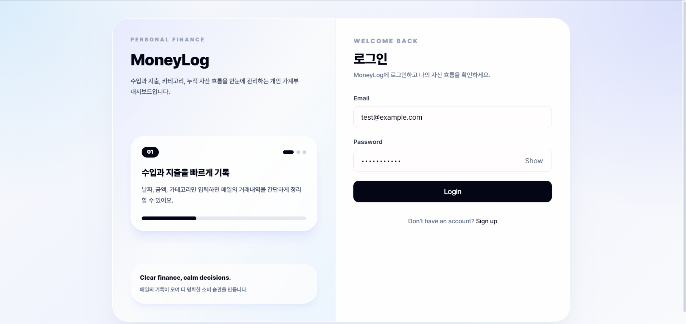
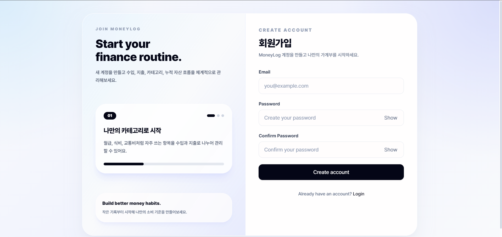
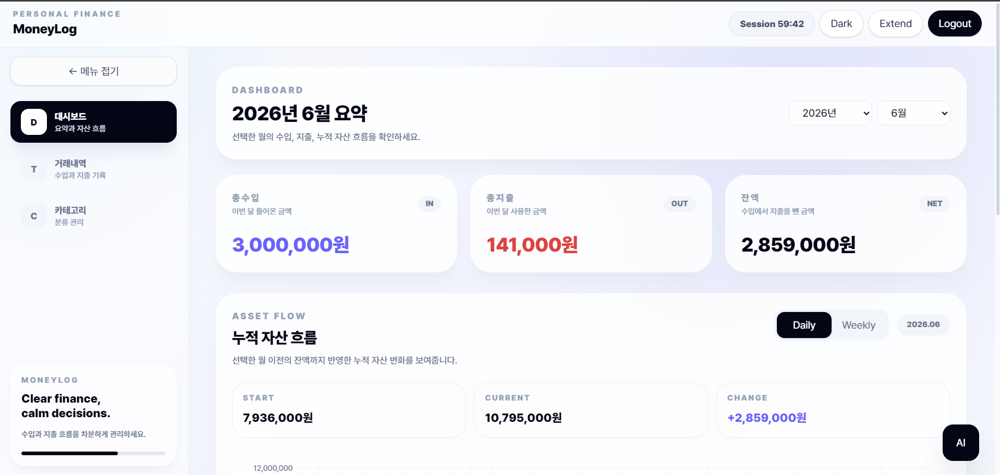
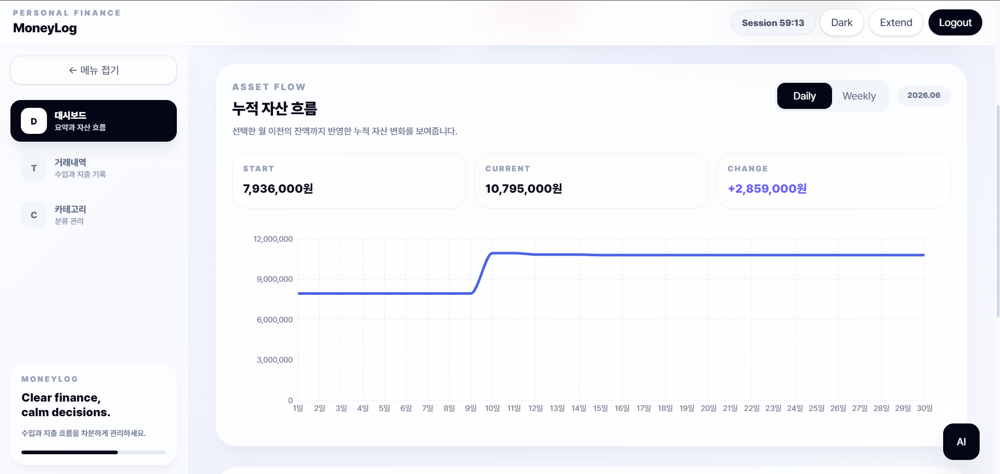
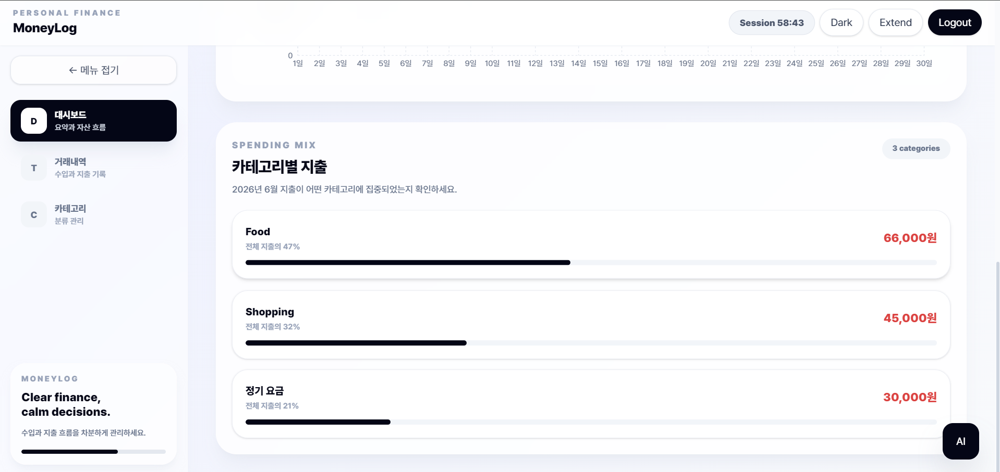
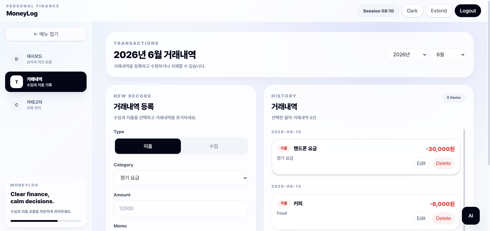
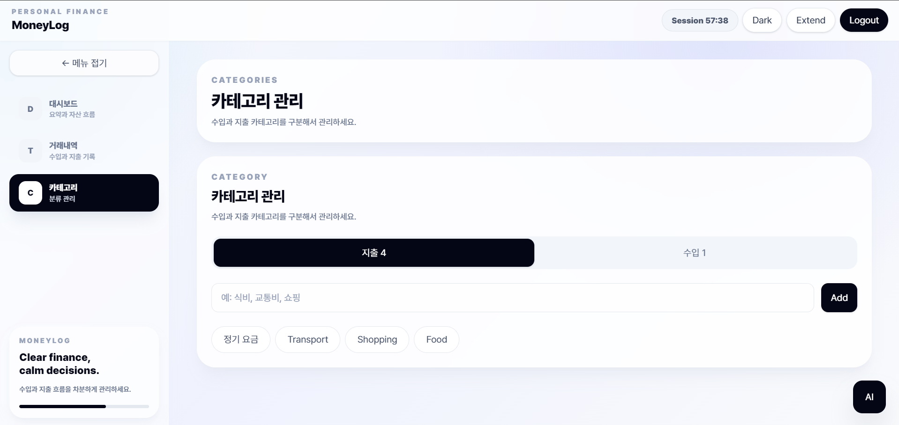
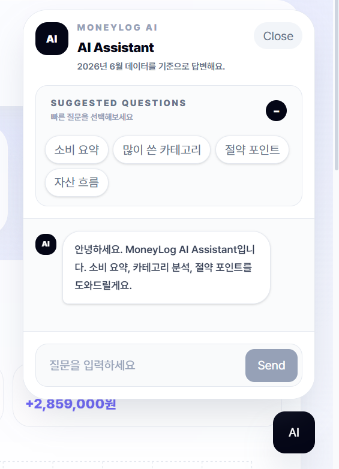
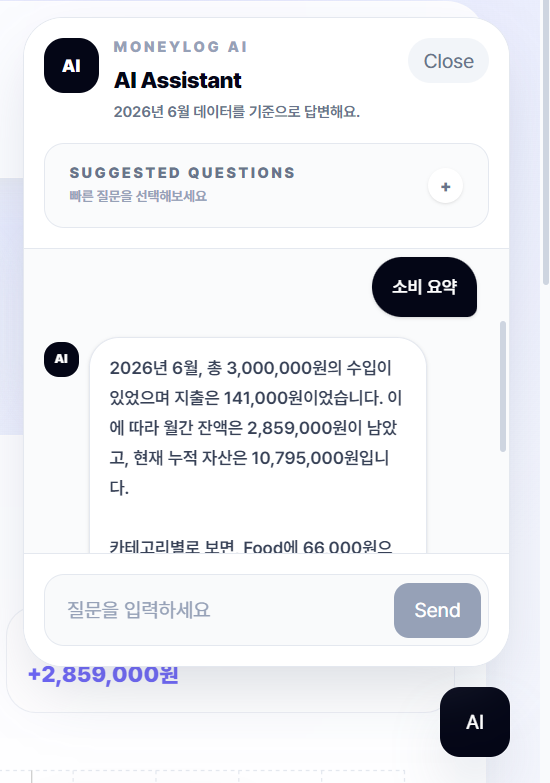

# MoneyLog

**MoneyLog**는 개인의 수입과 지출을 기록하고, 월별 소비 흐름과 누적 자산 변화를 시각적으로 확인할 수 있는 개인 가계부 웹 애플리케이션입니다.

단순한 거래내역 CRUD를 넘어, 카테고리별 지출 분석, 월별 필터링, 누적 자산 그래프, 세션 관리, 라이트/다크 모드, 그리고 Gemini API 기반 AI 소비 분석 Assistant 기능을 제공합니다.

---

## 프로젝트 소개

MoneyLog는 사용자가 자신의 소비 패턴을 더 쉽게 이해하고 관리할 수 있도록 만든 개인 금융 관리 서비스입니다.

사용자는 수입과 지출을 각각 카테고리별로 등록할 수 있으며, 선택한 월 기준으로 수입, 지출, 잔액, 카테고리별 지출, 누적 자산 흐름을 확인할 수 있습니다.

또한 AI Assistant를 통해 현재 월의 소비 요약, 많이 사용한 카테고리, 절약 포인트, 자산 흐름에 대한 자연어 분석을 받을 수 있습니다.

---

## 주요 기능

### 사용자 인증

- 회원가입
- 로그인
- JWT 기반 인증
- 로그인 세션 만료 시간 표시
- 세션 연장 기능
- 자동 로그아웃 처리

### 거래내역 관리

- 수입 / 지출 거래내역 등록
- 거래내역 수정
- 거래내역 삭제
- 거래 날짜, 금액, 메모, 카테고리 관리
- 선택한 연도/월 기준 거래내역 조회

### 카테고리 관리

- 수입 카테고리와 지출 카테고리 분리
- 카테고리 등록
- 카테고리 수정
- 카테고리 삭제
- 카테고리 타입별 토글 UI 제공

### 대시보드

- 월간 총수입, 총지출, 잔액 요약
- 카테고리별 지출 요약
- 누적 자산 흐름 그래프
- Daily / Weekly 그래프 전환
- 선택한 월 이전 잔액까지 반영한 누적 자산 계산

### AI Assistant

- Gemini API 기반 AI 소비 분석
- 현재 선택한 연도/월의 MoneyLog 데이터를 기반으로 답변
- 소비 요약
- 많이 쓴 카테고리 분석
- 절약 포인트 제안
- 자산 흐름 설명
- 플로팅 챗봇 UI
- 추천 질문 토글
- 메시지 자동 스크롤

### UI / UX

- 사이드바 기반 레이아웃
- 상단바 세션 정보 표시
- 라이트 / 다크 모드
- 로그인 / 회원가입 페이지 디자인 개선
- 반응형 카드형 UI
- Pretendard 폰트 적용

---

## 기술 스택

### Frontend

- React
- TypeScript
- Vite
- Tailwind CSS
- Recharts
- Axios 또는 Fetch 기반 API 통신

### Backend

- FastAPI
- SQLAlchemy
- Alembic
- Pydantic
- JWT Authentication
- Python-dotenv

### Database

- PostgreSQL
- Supabase PostgreSQL

### AI

- Gemini API
- google-genai SDK

### Version Control

- Git
- GitHub

---

## 프로젝트 구조

```text
Moneylog/
├── backend/
│   ├── app/
│   │   ├── api/
│   │   │   └── v1/
│   │   │       ├── auth.py
│   │   │       ├── categories.py
│   │   │       ├── dashboard.py
│   │   │       ├── transactions.py
│   │   │       ├── ai.py
│   │   │       └── router.py
│   │   ├── core/
│   │   │   ├── config.py
│   │   │   ├── database.py
│   │   │   └── security.py
│   │   ├── models/
│   │   ├── repositories/
│   │   ├── schemas/
│   │   └── services/
│   ├── alembic/
│   ├── requirements.txt
│   └── .env
│
├── frontend/
│   ├── src/
│   │   ├── api/
│   │   ├── components/
│   │   │   ├── ai/
│   │   │   ├── dashboard/
│   │   │   └── layout/
│   │   ├── pages/
│   │   ├── types/
│   │   └── utils/
│   ├── package.json
│   └── vite.config.ts
│
└── README.md
```

---

## 주요 화면

### 로그인



### 회원가입



### 대시보드





### 거래내역



### 카테고리 관리



### AI Assistant




### 로그인 / 회원가입

- MoneyLog 서비스 소개
- 자동 전환 카드뉴스
- Password Show / Hide
- 회원가입 Confirm Password

> 스크린샷 추가 예정

### 대시보드

- 월간 수입 / 지출 / 잔액 요약
- 누적 자산 흐름 그래프
- 카테고리별 지출 분석
- Daily / Weekly 전환

> 스크린샷 추가 예정

### 거래내역

- 수입 / 지출 등록
- 거래내역 수정 및 삭제
- 거래내역 리스트 스크롤 UI

> 스크린샷 추가 예정

### 카테고리 관리

- 수입 / 지출 카테고리 분리
- 토글 기반 카테고리 관리 UI

> 스크린샷 추가 예정

### AI Assistant

- Gemini API 기반 소비 분석
- 추천 질문
- 자연어 질문 답변

> 스크린샷 추가 예정

---

## 핵심 구현 내용

### 1. JWT 기반 인증과 세션 관리

로그인 성공 시 백엔드는 JWT Access Token을 발급합니다.
프론트엔드는 토큰을 LocalStorage에 저장하고, API 요청 시 Authorization Header에 Bearer Token을 포함합니다.

또한 토큰의 만료 시간을 계산하여 상단바에 남은 세션 시간을 표시하고, 사용자가 직접 세션을 연장할 수 있도록 구현했습니다.

---

### 2. 수입 / 지출 카테고리 분리

카테고리 모델에 `type` 필드를 추가하여 수입 카테고리와 지출 카테고리를 분리했습니다.

이를 통해 거래 등록 또는 수정 시 선택한 거래 타입에 맞는 카테고리만 표시되도록 구현했습니다.

```text
income  → 월급, 용돈, 부수입
expense → 식비, 교통비, 쇼핑
```

---

### 3. 월별 필터링

대시보드, 거래내역, 카테고리별 지출 요약은 선택한 `year`, `month` 값을 기준으로 조회됩니다.

프론트엔드에서 연도와 월을 선택하면 백엔드 API에 Query Parameter로 전달합니다.

```text
GET /api/v1/transactions?year=2026&month=6
GET /api/v1/dashboard/summary?year=2026&month=6
GET /api/v1/dashboard/category-summary?year=2026&month=6
```

---

### 4. 누적 자산 흐름 그래프

단순히 선택한 월의 거래내역만 계산하는 것이 아니라, 선택한 월 이전의 누적 잔액을 먼저 계산한 뒤 해당 월의 수입과 지출을 반영합니다.

이를 통해 월이 바뀌어도 자산 흐름이 0원부터 다시 시작하지 않고 실제 누적 자산 흐름을 보여줍니다.

```text
선택 월 이전 누적 잔액
+
선택 월의 일별/주별 수입·지출
=
누적 자산 흐름
```

지원 단위:

- Daily
- Weekly

---

### 5. Gemini API 기반 AI Assistant

AI Assistant는 현재 선택한 연도와 월의 MoneyLog 데이터를 백엔드에서 요약한 뒤 Gemini API에 전달합니다.

AI에 전달하는 데이터는 전체 거래내역이 아니라 다음과 같이 요약된 데이터 중심으로 구성했습니다.

```text
- 월간 총수입
- 월간 총지출
- 월간 잔액
- 월 시작 전 누적 잔액
- 현재 누적 잔액
- 카테고리별 지출 상위 데이터
- 최근 거래내역 최대 10개
```

이를 통해 불필요한 데이터 전송을 줄이고, 사용자의 질문에 필요한 맥락만 AI에게 제공합니다.

---

## API 명세

### Auth

| Method | Endpoint               | Description         |
| ------ | ---------------------- | ------------------- |
| POST   | `/api/v1/auth/signup`  | 회원가입            |
| POST   | `/api/v1/auth/login`   | 로그인              |
| POST   | `/api/v1/auth/refresh` | Access Token 재발급 |

### Categories

| Method | Endpoint                           | Description        |
| ------ | ---------------------------------- | ------------------ |
| GET    | `/api/v1/categories`               | 카테고리 목록 조회 |
| POST   | `/api/v1/categories`               | 카테고리 생성      |
| PUT    | `/api/v1/categories/{category_id}` | 카테고리 수정      |
| DELETE | `/api/v1/categories/{category_id}` | 카테고리 삭제      |

### Transactions

| Method | Endpoint                                | Description   |
| ------ | --------------------------------------- | ------------- |
| GET    | `/api/v1/transactions`                  | 거래내역 조회 |
| POST   | `/api/v1/transactions`                  | 거래내역 생성 |
| PUT    | `/api/v1/transactions/{transaction_id}` | 거래내역 수정 |
| DELETE | `/api/v1/transactions/{transaction_id}` | 거래내역 삭제 |

### Dashboard

| Method | Endpoint                             | Description               |
| ------ | ------------------------------------ | ------------------------- |
| GET    | `/api/v1/dashboard/summary`          | 월간 요약 조회            |
| GET    | `/api/v1/dashboard/category-summary` | 카테고리별 지출 요약 조회 |
| GET    | `/api/v1/dashboard/asset-trend`      | 누적 자산 흐름 조회       |

### AI

| Method | Endpoint          | Description            |
| ------ | ----------------- | ---------------------- |
| POST   | `/api/v1/ai/chat` | AI Assistant 답변 생성 |

---

## 실행 방법

### Backend 실행

```bash
cd backend
python -m venv venv
```

Windows PowerShell:

```powershell
.\venv\Scripts\Activate.ps1
```

패키지 설치:

```bash
pip install -r requirements.txt
```

`.env` 파일 생성:

```env
DATABASE_URL=your_database_url
SECRET_KEY=your_secret_key
ALGORITHM=HS256
ACCESS_TOKEN_EXPIRE_MINUTES=60
GEMINI_API_KEY=your_gemini_api_key
```

서버 실행:

```bash
uvicorn app.main:app --reload
```

---

### Frontend 실행

```bash
cd frontend
npm install
npm run dev
```

---

## 환경 변수

### Backend `.env`

```env
DATABASE_URL=
SECRET_KEY=
ALGORITHM=
ACCESS_TOKEN_EXPIRE_MINUTES=
GEMINI_API_KEY=
```

주의:

```text
.env 파일은 절대 GitHub에 업로드하지 않습니다.
API Key는 프론트엔드에 저장하지 않고 백엔드에서만 사용합니다.
```

---

## 트러블슈팅

### 1. 401 Unauthorized

토큰이 만료되었거나 잘못된 토큰일 수 있습니다.

해결 방법:

- 로그아웃 후 다시 로그인
- Authorization Header 확인
- Access Token 만료 여부 확인

---

### 2. `OPENAI_API_KEY is not set` 또는 `GEMINI_API_KEY is not set`

`.env` 파일에 API Key가 없거나 백엔드에서 환경변수를 읽지 못하는 경우입니다.

해결 방법:

```bash
python -c "import os; from dotenv import load_dotenv; load_dotenv(); print(os.getenv('GEMINI_API_KEY') is not None)"
```

`True`가 출력되어야 정상입니다.

---

### 3. PowerShell에서 한글 응답이 깨지는 경우

PowerShell 콘솔 인코딩 문제일 수 있습니다.

```powershell
chcp 65001
[Console]::OutputEncoding = [System.Text.Encoding]::UTF8
$OutputEncoding = [System.Text.Encoding]::UTF8
```

브라우저에서는 정상적으로 표시될 수 있습니다.

---

### 4. Tailwind CSS v4 오류

Tailwind CSS v4에서는 기존의 `@tailwind base`, `@tailwind components`, `@tailwind utilities` 방식 대신 다음 방식을 사용합니다.

```css
@import "tailwindcss";
```

또한 `group`, `group-hover` 등 일부 클래스는 `@apply` 안에서 사용할 때 오류가 발생할 수 있어 JSX className 또는 일반 CSS 선택자로 분리했습니다.

---

## 향후 개선사항

- 비밀번호 찾기 / 재설정 기능
- 이메일 인증 기능
- 거래내역 검색 및 필터 기능
- 월별 소비 비교 카드
- 예산 설정 기능
- 영수증 이미지 업로드 후 AI 자동 거래 등록
- AI 카테고리 자동 추천
- 배포 환경 구축
- 테스트 코드 작성
- 모바일 UI 최적화

---

## 프로젝트를 통해 학습한 점

- FastAPI 기반 REST API 설계
- JWT 인증과 세션 만료 처리
- SQLAlchemy ORM 기반 데이터 모델링
- Alembic을 활용한 데이터베이스 마이그레이션
- React 컴포넌트 분리와 상태 관리
- Tailwind CSS 기반 UI 개선
- Recharts를 활용한 데이터 시각화
- Gemini API를 활용한 AI 기능 연동
- 프론트엔드와 백엔드 간 인증 기반 API 통신
- 환경변수와 API Key 보안 관리

---

## License

This project is for personal portfolio and learning purposes.
